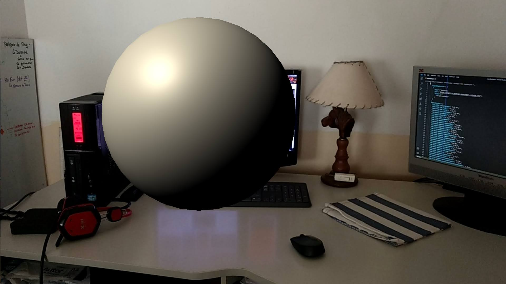
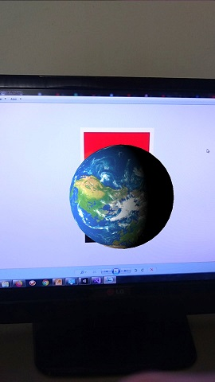
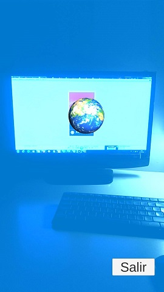
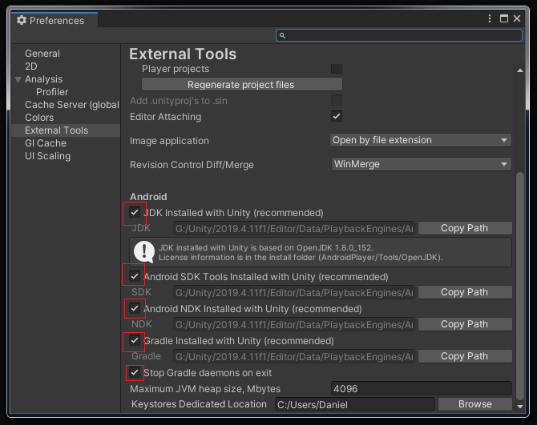

# Actividad 3 Vuforia- Diaz Daniel E.

## Sobre el proyecto 📦

_Este proyecto se desarrollo en su mayor parte siguiendo los instructivos dados por el docente_

* En una primera instancia para saber si funcionaba correctamente Vuforia, se agregó un target y una esfera. Al principio pensamos que no funcionaba ya que aparentemente no sucedia nada pero al usar un marcador pequeño y alejarnos lo suficiente pudimos hallar una gran esfera

* Ahora trabajando solo, efectué el proximo paso sin seguir la guia dada por el docente, lo cual consistió en reducir considerablemente el tamaño de la esfera y asignarle el material obtenido de la descarga del Asset propuesto. Además añadí el script del asset que permite la rotacion y lo aceleré.

* Ahora, siguiendo la guia dada por el docente agregué el prefab del asset con un tamaño apenas mayor que la esfera creada por mi y  sin eliminarla. Es así que experimente lo que seria ver a traves de otro objeto en RA ( ya que una esfera está dentro de otra). Entonces, si se enfoca de cerca, tendremos el mundo pequeño con una vista celeste por estar contenido en el mundo más grande el cual vemos recien al alejarnos del target.

Además agregué una UI para finalizar la aplicacion.

## Despliegue 🚀

_Para poder hacer el Build para Android es importante que en la instalación de Unity (a través de la selección de la versión que deseamos en Unity Hub) seleccionemos el soporte para Android Build, esto incluye la descarga de Android Studio, junto con su SDK, NDK y Gradle ._

**Si no tenemos ( en Edit -> Preferences -> External Tools) la instalacion de unity por defecto NO funcionará**
Para ello deben estar todos tildados. Caso contrario, dará error ( sitauacion que se dio con todos los integrantes de grupo)

## Expresiones de Gratitud 🎁

* Gracias por esperarme a que recupere internet 🍺 